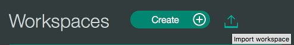
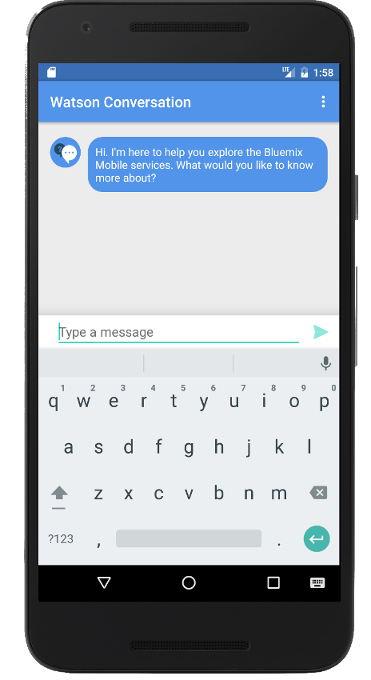
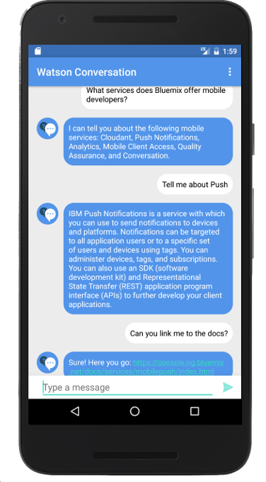

## Conversation
IBM Cloud Mobile Starter for Conversation in Android

### Table of Contents
* [Summary](#summary)
* [Requirements](#requirements)
* [Conversation Configuration](#conversation-configuration)
* [Mobile Foundation Configuration](#mobile-foundation-configuration)
* [Run](#run)
* [License](#license)

### Summary
This IBM Cloud Mobile Starter showcases the Mobile Foundation and Watson Conversation service and provides the integration points for each of the IBM Cloud Mobile services.

### Requirements
* [Android Studio](https://developer.android.com/studio/index.html)
* An [IBM Cloud Account](https://www.bluemix.net/)

### Conversation Configuration
Create or upload a conversation file to your Watson Conversation service (already created) on IBM Cloud in order to allow for interaction with the service.

In the dashboard of your Conversation service on IBM Cloud run the Conversation tooling dashboard by clicking the **Launch tool** button:

Now create your own Conversation Workspace or import the sample workspace named `bluemix_mobile_qa_workspace.json` is included in this project by selecting the import button from your Workspaces screen and navigating to the provided .json:

After you have created or uploaded a Conversation workspace you need to get the Workspace Id. Click **View details** to see the Workspace information. Save the **WorkspaceID** which is to be included in application configuration:

### Mobile Foundation Configuration

##### Steps:
Follow the steps below to configure the Mobile Foundation service

* Open the project in Android Studio and perform a Gradle Sync.
* Navigate to `MainActivity.java`, search for the `YOUR_WORKSPACE_ID` placeholder, and replace with the Watson Conversation **WorkspaceID** saved or copied earlier.  This placeholder is found in the `ConversationTask` class, `doInBackground()` function.

* Go to the project folder and find a the shell scripts by name **mfpregisterapp.sh** and **mfpstartersetup.sh**. Ensure that you have *execute* and *write* permissions to run these scripts.
* Run **mfpregisterapp.sh**.
* Run **mfpstartersetup.sh**. This should set up the Mobile Foundation prereqs for running the starter.
* Update **mfpclient.properties**: Replace the **host** value with **mobilefoundationUrl** value from **credentials.xml**. Keep the other things as default.

### Run
You can now run the application on a simulator or a physical device:

The Watson Conversation service allows you to add a natural language interface to your application to automate interactions with your end users. This project shows an application of this service that allows you to have a conversation with Watson. Watson sends an initial conversation which you can then reply to and continue the interaction with the service.

### License
This package contains code licensed under the Apache License, Version 2.0 (the "License"). You may obtain a copy of the License at http://www.apache.org/licenses/LICENSE-2.0 and may also view the License in the LICENSE file within this package.
