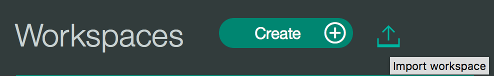

## Conversation
IBM Cloud Mobile Starter for Conversation in Cordova

[](https://bluemix.net)


### Table of Contents
* [Summary](#summary)
* [Requirements](#requirements)
* [Conversation Configuration](#conversation-configuration)
* [Mobile Foundation Configuration](#mobile-foundation-configuration)
* [Run](#run)
* [License](#license)

### Summary
This IBM Cloud Mobile Starter will showcase the Mobile Foundation and Conversation service from Watson and provides you integration points for each of the IBM Cloud Mobile services.

### Requirements
* [Android Studio](https://developer.android.com/studio/index.html)
* Xcode 9.0+
* A [IBM Cloud Account](https://www.bluemix.net/)
* Node.js and npm

### Conversation Configuration
You will need to create or upload a conversation file to your Watson Conversation service (created for you) on IBM Cloud to allow interaction with the service.

From the dashboard of your Conversation service on IBM Cloud, run the Conversation tooling dashboard by clicking the **Launch tool** button.


Now create your own Conversation Workspace or import the sample workspace named `bluemix_mobile_qa_workspace.json` included in this project by selecting the import button from your Workspace screen and navigate to the provided .json.



After you have created or uploaded a Conversation Workspace you will need to get to the Workspace Id. Click the **View details** list item to see the Workspace information. Save the **WorkspaceID** which you need to include in our application configuration.


### Mobile Foundation Configuration

##### Steps:
* Install the dependencies required by the project.
```bash
$ npm install
```
* Add the cordova plugin for mfp using the below command.
```bash
$ cordova plugin add cordova-plugin-mfp
```
* Replace the url in config.xml with the host of the mobile foundation provisioned for you. <mfp:server runtime="mfp" url="" />
* Navigate to `www/js/index.js`, search for the `YOUR_WORKSPACE_ID` placeholder, and replace with the Watson Conversation **WorkspaceID** you saved or copied earlier.
* Go to the project folder in command line and find a shell scripts by name  **mfpregisterapp.sh** and **mfpstartersetup.sh**  in the platforms directory and ensure that you have execute and write permissions to run these scripts. 
* Run **mfpstartersetup.sh**. This should set up the Mobile Foundation pre-reqs for running the starter. This script is present in both android and iOS platforms and needs to be executed to register the respective platform.
* Prepare the cordova project to copy the files into the platform folder by running the below command.
```bash
$ cordova prepare
```
### Run
You can now run the application on a simulator or physical device. To run the application in:
* Android devices or emulator, open the android project under 'platforms' directory.
* iOS devices or simulator, open the iOS project under 'platforms' directory.

The Watson Conversation service allows you to add a natural language interface to your application to automate interactions with your end users. This project shows an application of this service that allows you to have a conversation with Watson. Watson will send an initial conversation which you can then reply to and continue to interact with the service.

### License
This package contains code licensed under the Apache License, Version 2.0 (the "License"). You may obtain a copy of the License at http://www.apache.org/licenses/LICENSE-2.0 and may also view the License in the LICENSE file within this package.
